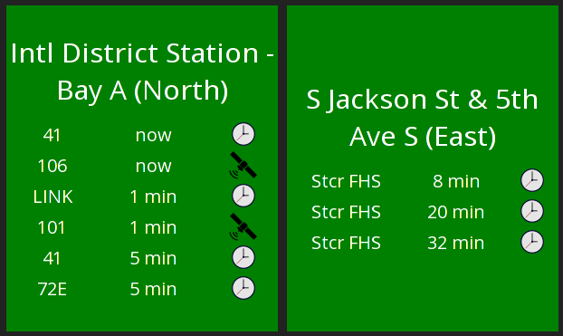

Seatransit Dashing Widget
=========================

This is a dashing widget for displaying schedules/live tracking data from Seattle transit.



Installation
------------
Dashing widgets have the worst installation method I've ever seen. Most widgets suggest you manually copy every file into a dashing board. You can use `dashing install` but it only works if the widget is in a gist and the command will not install things like assets. The following is a simple cut and paste, so long as you have a working dashing dashboard and replace the first _cd_ with the correct path to it.

```
cd <path/to/your/dashboard>
git clone https://github.com/sumdog/seatransit
ln -rs seatransit/assets assets/images/seatransit
ln -rs seatransit/jobs/seatransit.rb jobs/
ln -rs seatransit/widget widgets/seatransit
```

Configuration
-------------
You'll need to identify your stop/station ID using the [Sound Transit Real-Time Arrivals](http://m.soundtransit.org/stops-and-arrivals). The stop number appears when you click on a stop. Place a list of those numbers in the `seatransit.rb` job.

```
# jobs/seatransit.rb
stops = [621, 1652]
...
```

Then simply add each of those stops to your dashboard.

```
<li data-row="1" data-col="1" data-sizex="1" data-sizey="1">
    <div data-id="seatransit_621" data-view="Seatransit"></div>
</li>

<li data-row="1" data-col="1" data-sizex="1" data-sizey="1">
    <div data-id="seatransit_1652" data-view="Seatransit"></div>
</li>
```

Real-time vs Scheduled
----------------------
The Seattle OneBusAway API provides both scheduled and predicted arrival times. If the arrive data being used in scheduled, the widget displays a little clock icon. If it's predicted, it's a satellite icon. I'm not actually sure if Seattle uses GPS tracking on buses. Predicted may just be calculated by speed-limits and bus drivers signaling when they reach a stop, so take the satellite icon with a grain of salt. (Interestingly enough, none of the light rail/trams seems to have predicted time. It's all scheduled).

License
-------
Clock Icon is CC-AT-SA 4.0 by this person:
https://en.wikipedia.org/wiki/User:GW_Simulations

Satellite Icon is CC-AT-SA 4.0 by this person:
https://commons.wikimedia.org/wiki/User:Maxxl2

Seatransit is GNU GPLv3:

This program is free software: you can redistribute it and/or modify
it under the terms of the GNU General Public License as published by
the Free Software Foundation, either version 3 of the License, or
(at your option) any later version.

This program is distributed in the hope that it will be useful,
but WITHOUT ANY WARRANTY; without even the implied warranty of
MERCHANTABILITY or FITNESS FOR A PARTICULAR PURPOSE.  See the
GNU General Public License for more details.

You should have received a copy of the GNU General Public License
along with this program.  If not, see <http://www.gnu.org/licenses/>.
